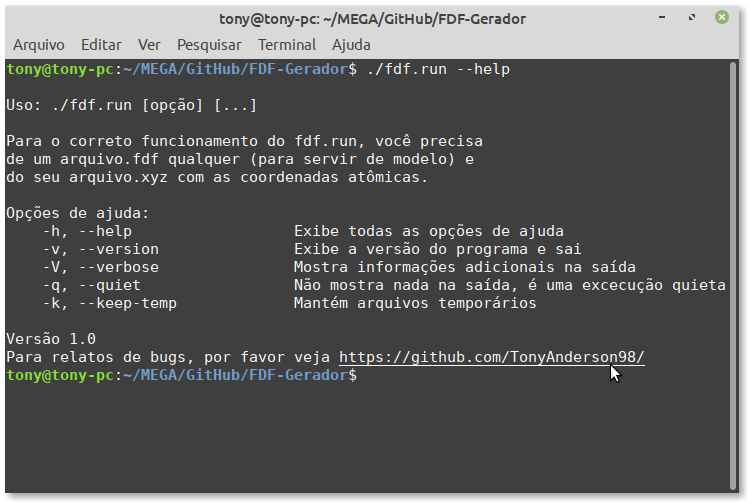

# FDF-Gerador
 
## O que é o FDF-Gerador
  
É um simples (porém muito eficiente) gerador de arquivos do tipo `Flexible Data Format (FDF)` para o código computacional `SIESTA`. É parte de um conjunto de programas do Laboratório de Simulação - UFMA.

> Aprenda mais sobre FDF's 

## Como usar

``` bash
chmod +x ./fdf.run
./fdf.run
```

## Screenshots

